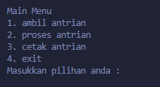

# Aplikasi Antrian (Queue) Sederhana

## Pengenalan

Halo sobat programmer! Repo ini berisi implementasi struktur data antrian (queue) menggunakan bahasa C. Aplikasi ini dibuat untuk mendemonstrasikan cara kerja antrian dalam pemrograman. Keren kan?

## Apa itu Queue?

Queue atau Antrian itu kayak antrian di kasir supermarket atau loket tiket. Prinsipnya FIFO (First In First Out), yang artinya yang pertama masuk bakal keluar duluan. Jadi nggak bisa nyerobot ya!

Bayangkan gini:

- Kamu antri di loket tiket bioskop
- Yang datang duluan dilayani duluan
- Yang baru datang harus antri di belakang

## Fitur Aplikasi

Aplikasi ini punya beberapa fitur kece:

1. **Ambil Antrian** - Menambahkan angka baru ke antrian (proses enqueue)
2. **Proses Antrian** - Mengeluarkan angka dari antrian (proses dequeue)
3. **Cetak Antrian** - Menampilkan seluruh isi antrian saat ini
4. **Exit** - Keluar dari aplikasi dan membersihkan memori

Bonus: Aplikasi ini punya 2 antrian terpisah (a dan b) yang bisa kamu pilih!

## Cara Pakai

1. Compile kode dengan compiler C favoritmu
2. Jalankan program
3. Ikuti menu yang muncul di layar
4. Pilih opsi yang kamu mau (1-4)
5. Untuk opsi 1 dan 2, pilih antrian mana yang ingin dipakai (a atau b)

## Struktur Project

- `main.c` - Program utama dengan menu interaktif
- `queue.h` dan `queue.c` - Implementasi struktur data queue
- `linked.h` dan `linked.c` - Implementasi linked list untuk queue
- `print.h` dan `print.c` - Fungsi untuk menampilkan menu
- `convention.h` - Definisi konstanta dan typedef

## Tampilan Menu

## Cara Kerja

Ketika kamu ambil nomor antrian, angka akan bertambah otomatis. Setiap antrian (a dan b) punya penghitung sendiri-sendiri. Antrian diimplementasikan menggunakan linked list, jadi bisa terus bertambah selama memori masih cukup!

Saat memproses antrian, program akan mengeluarkan nomor terdepan dan menampilkannya ke layar.

## Tips

- Jangan lupa selalu pilih Exit (4) sebelum menutup program untuk mengosongkan memori!
- Kamu bisa gunakan dua antrian untuk membedakan prioritas atau kategori!

Selamat mencoba dan happy coding! 🚀
